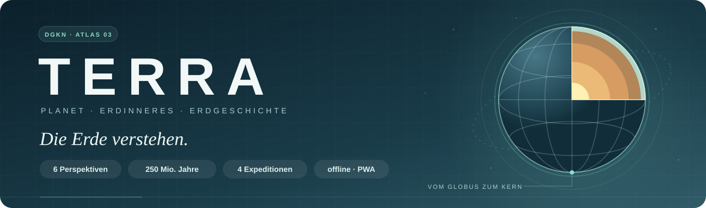
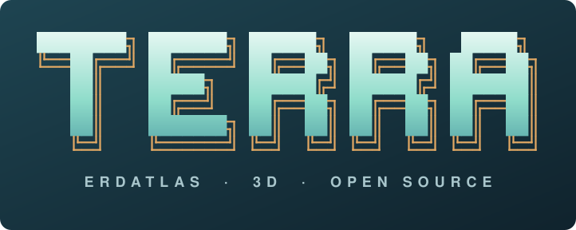
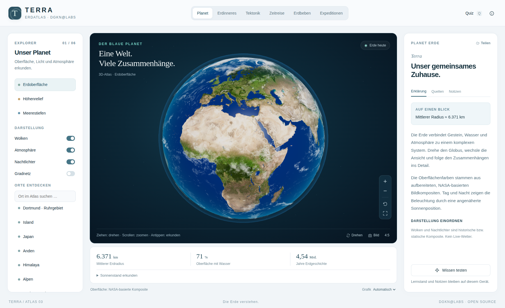
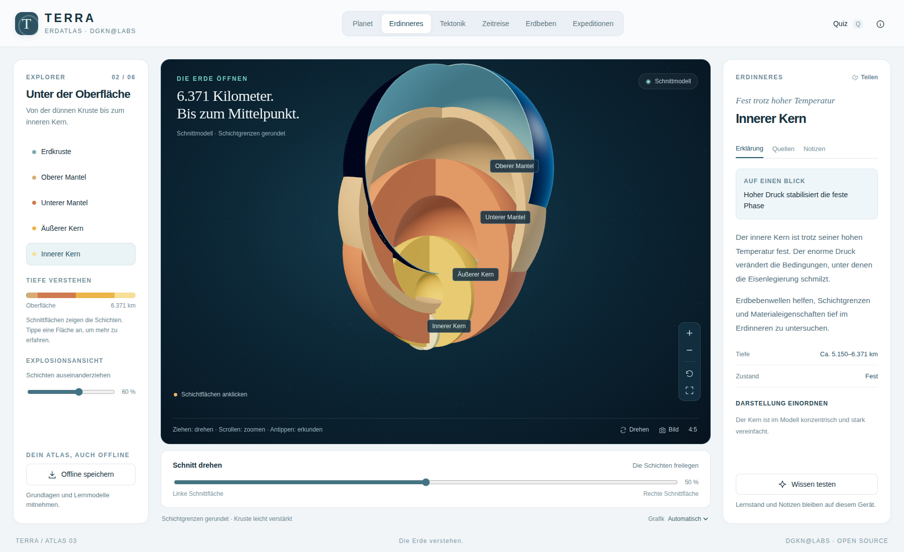
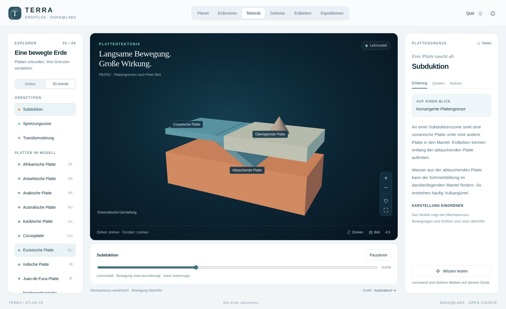
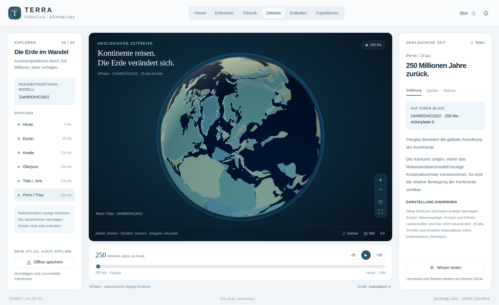
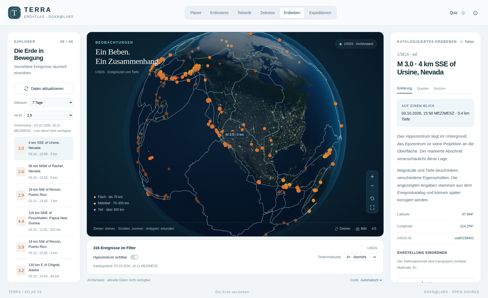
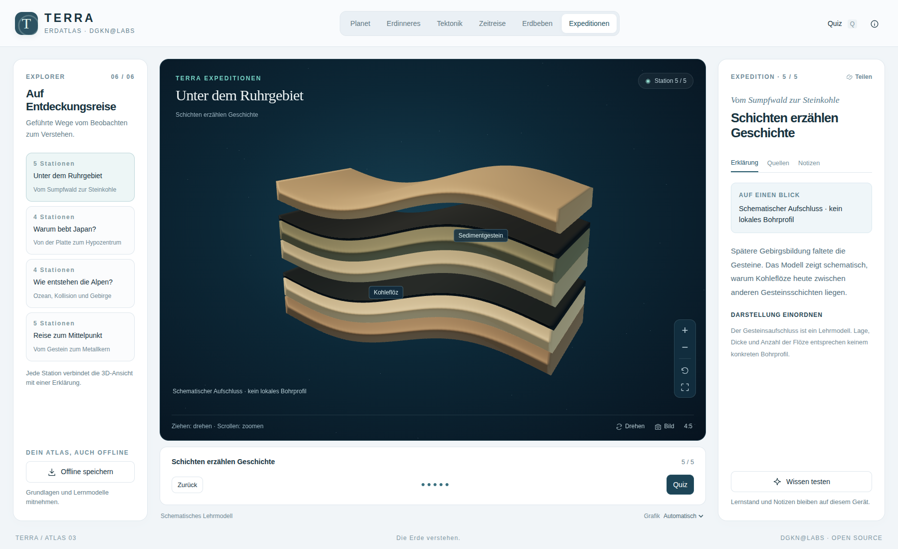
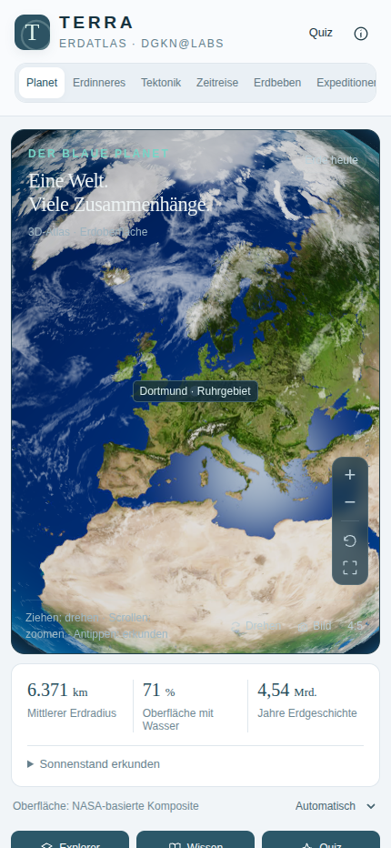
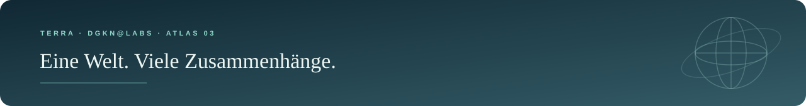

<div align="center">





<details>
<summary>Originales ASCII-Logo zum Kopieren</summary>

```text
  ████████╗ ███████╗ ██████╗  ██████╗   █████╗
  ╚══██╔══╝ ██╔════╝ ██╔══██╗ ██╔══██╗ ██╔══██╗
     ██║    █████╗   ██████╔╝ ██████╔╝ ███████║
     ██║    ██╔══╝   ██╔══██╗ ██╔══██╗ ██╔══██║
     ██║    ███████╗ ██║  ██║ ██║  ██║ ██║  ██║
     ╚═╝    ╚══════╝ ╚═╝  ╚═╝ ╚═╝  ╚═╝ ╚═╝  ╚═╝
E R D A T L A S  ·  3 D  ·  O P E N  S O U R C E
```

</details>

**Vom blauen Planeten bis zum inneren Kern.**<br>
Kontinente bewegen. Erdschichten öffnen. Die Geschichte unter deinen Füßen entdecken.<br>
**Ein interaktiver Erdatlas für Schule, Studium und Lehre. Auf Deutsch. Im Browser und als Desktop-App. Auch offline.**


<br>


[](https://github.com/dogenc/TERRA/actions/workflows/atlas-quality.yml)


[**⬇️ Download**](https://github.com/dogenc/TERRA/releases) · [**Entdecken**](#-sechs-perspektiven-auf-die-erde) · [**Expeditionen**](#-vier-expeditionen) · [**Screenshots**](#-screenshots) · [**Starten**](#-schnellstart) · [**Desktop**](#️-desktop-apps) · [**Technik**](#-technik--qualität)

</div>

---

## 💡 Ein Planet. Viele Zusammenhänge.

Warum bebt Japan? Wie wird aus einem Sumpfwald Steinkohle? Was liegt unter der Erdkruste – und wo lagen unsere Kontinente vor 250 Millionen Jahren?

TERRA verbindet einen drehbaren **3D-Globus**, echte geologische Datensätze und verständliche Lehrmodelle. Vom Überblick geht es direkt ins Detail: eine Erdschicht auswählen, eine Platte anklicken, ein Erdbeben untersuchen oder einer Expedition folgen. Erklärungen und Quellen bleiben neben dem Modell sichtbar.

Der dritte Atlas der Familie von [**CORPUS**](https://github.com/dogenc/CORPUS-Anatomieatlas) und [**CELLULA**](https://github.com/dogenc/CELLULA): helle Wissenspanels, klare Typografie und ein großer, ruhiger Modellbereich. Hier dreht sich alles um **unsere Erde**.

<table>
<tr>
<td align="center" width="33%">🌍<br><b>Entdecken</b><br><sub>Oberfläche, Erdinneres und Plattengrenzen räumlich erkunden</sub></td>
<td align="center" width="33%">🎓<br><b>Verstehen</b><br><sub>Zusammenhänge in Expeditionen erleben und im Quiz festigen</sub></td>
<td align="center" width="33%">👩‍🏫<br><b>Erklären</b><br><sub>Ansichten teilen und Bilder mit Quellen für Folien exportieren</sub></td>
</tr>
</table>

---

## 🌐 Sechs Perspektiven auf die Erde

### 01 · Planet — unser gemeinsames Zuhause

Die Erde als frei drehbarer Globus: **NASA-basierte Tageskomposite**, Nachtlichter, Atmosphäre und eine statische Wolkendarstellung. Höhen- und Meerestiefenfarben machen die großen Formen der Oberfläche sichtbar.

- **Drei Ansichten:** Erdoberfläche, Höhenrelief und Meerestiefen.
- **Licht erkunden:** UTC-Uhrzeit und Jahreszeit verändern den angenäherten Sonnenstand.
- **Orientierung:** zuschaltbares Gradnetz, acht vorbereitete Orte und Koordinaten bei Auswahl auf dem Globus.
- **Vom Ruhrgebiet nach Japan:** Orte suchen, auswählen und mit der Kamera anfliegen.

Die Reliefansicht zeigt Rasterfarben auf der Kugel. Wolken und Nachtlichter stammen aus statischen beziehungsweise historischen Kompositen.

### 02 · Erdinneres — den Planeten aufklappen

**Fünf auswählbare Erdschichten** mit geschlossenen Schnittflächen. Das Schnittmodell lässt sich drehen; die Explosionsansicht zieht die Schichten auseinander.

| Schicht | Was du erkundest |
|---|---|
| **Erdkruste** | Die dünne äußere Gesteinshülle |
| **Oberer Mantel** | Gestein, das sich über lange Zeiträume verformen kann |
| **Unterer Mantel** | Das tiefe, überwiegend feste Mantelmaterial |
| **Äußerer Kern** | Die flüssige metallische Schicht |
| **Innerer Kern** | Den festen Kern im Zentrum der Erde |

Jede Auswahl erhält eine Erklärung, gerundete Tiefenangaben und Quellen. Die Kruste ist im Lehrmodell sichtbar verstärkt.

### 03 · Tektonik — eine Welt in Bewegung

Die Kartenansicht nutzt das **PB2002-Modell** mit **54 Plattenpolygonen und 241 Grenzsegmenten**. Platten lassen sich geografisch auf dem Globus auswählen; 16 benannte Hauptplatten sind direkt im Explorer erreichbar.

Drei animierte Detailmodelle zeigen, was an Plattengrenzen geschieht:

| Mechanismus | Im Modell beobachten |
|---|---|
| **Subduktion** | Eine Platte taucht unter die andere ab |
| **Spreizung** | Platten entfernen sich voneinander; neue Kruste entsteht |
| **Transformbewegung** | Platten gleiten seitlich aneinander vorbei |

Animationen abspielen, pausieren und den Ablauf mit dem Regler untersuchen. Die Bewegungen sind schematisch und zeigen keine realen Geschwindigkeiten. Die Alpen-Expedition ergänzt ein Modell zur **Kontinentkollision**.

### 04 · Zeitreise — 250 Millionen Jahre zurück

**Elf mitgelieferte GPlates-Rekonstruktionen** führen von heute bis vor **250 Millionen Jahren**: in Schritten von 25 Millionen Jahren, als einzelne Datenstände oder als Wiedergabe.

| Datenstand | Perspektive |
|---|---|
| **0–50 Ma** | Kontinente nahe ihren heutigen Positionen |
| **75–150 Ma** | Öffnung der Ozeane und Zerfall großer Landmassen |
| **175–250 Ma** | Die Anordnung rund um den Superkontinent Pangäa |

Modell: **ZAHIROVIC2022**, Ankerplatte 0. **Ma** bedeutet Millionen Jahre vor heute.

> Die Zeitreise zeigt rekonstruierte **heutige Konturen** an früheren Positionen. Die Daten bilden weder exakte damalige Küstenlinien noch damalige Landschaften ab; die elf Zustände sind diskrete Modellstände.

### 05 · Erdbeben — Ereignisse räumlich lesen

Der Atlas lädt den **USGS-Wochenfeed ab Magnitude 2,5**. Ereignisse erscheinen auf dem Globus, mit Farbe nach Tiefe; Filter grenzen Magnitude und Zeitraum ein.

Ein Ereignis auswählen und **Ort, Zeitpunkt, Magnitude, Koordinaten und Tiefe** gemeinsam betrachten. Die Tiefenlinie lässt sich maßstäblich oder **8-fach überhöht** darstellen; eine transparente Erde macht ihre Lage sichtbar.

Falls der aktuelle Abruf ausfällt, nutzt TERRA den letzten lokal gespeicherten oder den mitgelieferten Datensatz. Der Zeitstempel bleibt sichtbar und der Stand wird ausdrücklich als **Archivstand** gekennzeichnet.

### 06 · Expeditionen — den Zusammenhängen folgen

Vier geführte Lernreisen verbinden Orte, Modelle und Erklärungen. Jede Station zeigt den passenden Ausschnitt; Schritte lassen sich einzeln wählen und mit einem Quiz vertiefen.

---

## 🧭 Vier Expeditionen

| Lernreise | Stationen | Was du verstehst |
|---|:---:|---|
| **Unter dem Ruhrgebiet** | 5 | Vom Sumpfwald zur Steinkohle; Schichten und Faltung im schematischen Aufschluss |
| **Warum bebt Japan?** | 4 | Von der Plattenbewegung über Subduktion zum Hypozentrum |
| **Wie entstehen die Alpen?** | 4 | Ozean, Kontinentkollision und Gebirgsbildung |
| **Reise zum Mittelpunkt** | 5 | Von der Erdkruste durch den Mantel bis zum metallischen Kern |

**Ein Ort ist der Einstieg. Der Zusammenhang ist das Ziel.**

---

## 🎛️ Das 3D-Studio

| Werkzeug | Was es ermöglicht |
|---|---|
| **Drehen & zoomen** | Globus und Lehrmodelle mit Maus oder Touch erkunden; Ansicht zurücksetzen |
| **Schnittmodell** | Das Erdinnere öffnen, die Schichten wählen und auseinanderziehen |
| **Ansicht teilen** | Atlasbereich und Kamera in einem Link speichern |
| **PNG-Export** | Die aktuelle Ansicht als Bild mit Titel und Quellenangabe speichern |
| **4:5-Hochformat** | Ein Bild im Hochformat für Arbeitsblätter und Beiträge erzeugen |
| **Grafikqualität** | Automatisch, Sparsam oder Hoch; die Automatik passt die Renderauflösung an die Bildrate an |
| **Mobil & Vollbild** | Ausklappbare Explorer- und Wissenspanels auf kleinen Displays; großer Modellbereich im Vollbild |

### Lernen und mitnehmen

- **20 Quizfragen** mit Rückmeldung und lokalem Wiederholungsstand.
- **Notizen je Auswahl** für eigene Merksätze und Unterrichtsideen.
- **JSON-Export und Import** für Notizen und Lernstand.
- **Offline speichern** lädt Oberfläche, Bibliothek, Erdtexturen und geologische Daten auf das Gerät.
- **Lokale Speicherung:** Notizen und Lernstand bleiben im eigenen Browser. Die Anwendung verwendet keine Analyse-Tracker; der aktuelle USGS-Abruf und externe Quellenlinks benötigen eine Verbindung.

Nach dem vollständigen Offline-Speichern lässt sich der Atlas auch ohne Verbindung neu laden. Erdbeben werden dann aus einem gekennzeichneten Archivstand angezeigt.

### Tastenkürzel

| Taste | Aktion | Taste | Aktion |
|:---:|---|:---:|---|
| <kbd>1</kbd>–<kbd>6</kbd> | Atlasbereiche wechseln | <kbd>Q</kbd> | Quiz öffnen |
| <kbd>Leertaste</kbd> | Zeitreise / Detailanimation abspielen oder pausieren | <kbd>R</kbd> | Kamera zurücksetzen |
| <kbd>←</kbd> <kbd>→</kbd> | Datenstand oder Expeditionsstation wechseln | <kbd>Esc</kbd> | Mobile Seitenpanels schließen |

Die Kürzel greifen außerhalb von Eingabefeldern und geöffneten Dialogen.

---

## 📸 Screenshots

**Sieben echte Aufnahmen aus der laufenden Anwendung.** Die Desktopbilder zeigen den Atlas bei **1800 × 1100 Pixeln**, die mobile Aufnahme bei **430 × 932 Pixeln**. [Alle Bilder in voller Auflösung ansehen →](docs/screenshots/)

<a href="docs/screenshots/01-planet.png"></a>

<table>
<tr>
<td width="50%"><a href="docs/screenshots/02-erdinneres.png"></a><br><sub><b>Erdinneres</b> · Die Schichten des Planeten räumlich verstehen</sub></td>
<td width="50%"><a href="docs/screenshots/03-subduktion.png"></a><br><sub><b>Subduktion</b> · Eine Plattengrenze Schritt für Schritt untersuchen</sub></td>
</tr>
<tr>
<td width="50%"><a href="docs/screenshots/04-zeitreise.png"></a><br><sub><b>Zeitreise</b> · Rekonstruierte Kontinentpositionen vor 250 Ma</sub></td>
<td width="50%"><a href="docs/screenshots/05-erdbeben.png"></a><br><sub><b>Erdbeben</b> · Ereignisse, Tiefen und transparenter Archivstand</sub></td>
</tr>
</table>

<a href="docs/screenshots/06-ruhrgebiet.png"></a>
<sub><b>Unter dem Ruhrgebiet</b> · Vom Sumpfwald zur Steinkohle</sub>

<div align="center">
<br>
<a href="docs/screenshots/07-mobil.png"></a><br>
<sub><b>Mobil</b> · Den Planeten per Touch erkunden</sub>
</div>

---

## 🚀 Schnellstart

Für den lokalen Start genügt **Python 3**. Oberfläche, 3D-Bibliothek und Daten sind enthalten.

```bash
git clone https://github.com/dogenc/TERRA.git
cd TERRA
python3 start.py
```

Die Anwendung öffnet sich unter **http://127.0.0.1:8767**. Beenden mit <kbd>Strg</kbd> + <kbd>C</kbd>. Für das private Repository wird beim Klonen ein berechtigter GitHub-Zugang benötigt.

**Windows:** Doppelklick auf [`START_WINDOWS.cmd`](START_WINDOWS.cmd), wenn Python 3 installiert ist. Die Anleitung steht in [`START_HIER.txt`](START_HIER.txt). Ohne Python: die [Desktop-App](#️-desktop-apps) verwenden.

> [!NOTE]
> Über den lokalen Server öffnen. JavaScript-Module und Datensätze benötigen HTTP; ein direkter Doppelklick auf `dist/index.html` genügt nicht.

### Statisch hosten

Der Ordner **`dist/`** enthält die auslieferbare Website. **Kein Build-Befehl, kein Backend, kein Bundler.** Als Website-Wurzel `dist` einstellen. Offline-Web-App und Service Worker benötigen **HTTPS** oder **localhost**.

Sicherheits- und Cache-Header stehen in [`dist/_headers`](dist/_headers). Alle 3D-Bibliotheksdateien werden lokal mitgeliefert.

## 🖥️ Desktop-Apps

Die Electron-App liefert Oberfläche, 3D-Bibliothek, Erdtexturen und geologische Datensätze lokal mit. Für ihre Nutzung sind weder Python noch ein eigener Webserver erforderlich.

| Plattform | Paketformat |
|---|---|
| **Windows** | Setup-Installer `.exe` und portable `.exe` (ohne Installation, z. B. vom USB-Stick) |
| **macOS** | `.dmg` für Intel und Apple Silicon |

**[Veröffentlichte Downloads ansehen →](https://github.com/dogenc/TERRA/releases)**

Die App lädt den Atlas über das eigene Schema `terra://app` mit denselben Sicherheits-Headern wie die Website. Notizen und Lernstand bleiben zwischen den Starts erhalten. Nur der aktuelle USGS-Erdbebenabruf benötigt Internet; ohne Verbindung erscheint der gekennzeichnete Archivstand. Externe Quellenlinks öffnen sich im Standardbrowser.

Der [Desktop-Workflow](.github/workflows/desktop.yml) führt zuerst die vollständigen Browser- und Windows-Prüfungen aus. Erst nach erfolgreicher Prüfung werden die Installer gebaut. Er startet per Versions-Tag (`v1.0.0`) oder manuell über GitHub Actions; mit Versionsnummer entsteht zusätzlich ein Release.

Für die lokale Entwicklung:

```bash
cd desktop
npm ci
npm start
```

Eigene Pakete lassen sich anschließend mit `npm run dist:win` auf Windows bzw. `npm run dist:mac` auf macOS erzeugen. Die Apps sind nicht kostenpflichtig signiert; Hinweise zur Systemwarnung beim ersten Start stehen im jeweiligen Release.

---

## 🛠️ Technik & Qualität

**Vanilla JavaScript, ES-Module und Three.js 0.180.0.** Der Globus, das Erdinnere und die Lehrmodelle werden im Browser dargestellt. PB2002-Geometrien, Rekonstruktionen und der USGS-Archivdatensatz liegen lokal vor.

| Bereich | Dateien |
|---|---|
| **Oberfläche & Gestaltung** | [`dist/index.html`](dist/index.html), [`dist/style.css`](dist/style.css) |
| **Bedienung & Lernwerkzeuge** | [`dist/app.js`](dist/app.js) |
| **Globus, Schichten & Lehrmodelle** | [`dist/globe.js`](dist/globe.js) |
| **Wissen, Quellen, Expeditionen & Quiz** | [`dist/data.js`](dist/data.js) |
| **Texturen & geologische Daten** | [`dist/assets/`](dist/assets/) |
| **Offline-Web-App** | [`dist/sw.js`](dist/sw.js), [`manifest.webmanifest`](dist/manifest.webmanifest), [`offline-files.json`](dist/offline-files.json) |
| **Desktop-App** | [`desktop/`](desktop/) |
| **Automatische Prüfungen** | [`tests/browser.mjs`](tests/browser.mjs), [`tests/desktop.cjs`](tests/desktop.cjs), [`atlas-quality.yml`](.github/workflows/atlas-quality.yml) |
| **Lokaler Start** | [`start.py`](start.py), [`START_WINDOWS.cmd`](START_WINDOWS.cmd), [`START_HIER.txt`](START_HIER.txt) |

### Was geprüft wurde

Die automatisierte Chromium-Prüfung umfasst **elf Prüfbereiche**:

- Darstellung des Planeten, Schichtauswahl und Explosionsansicht.
- Alle drei Plattenmechanismen und unterschiedliche echte Rekonstruktionsstände.
- USGS-Ausfall mit gekennzeichnetem Archiv, Ereignisauswahl und Tiefenüberhöhung.
- Ruhrgebiet-Expedition, Quizrückmeldung und gespeicherter Lernstand.
- Notizen nach Neuladen und tatsächlicher PNG-Export.
- Mobile Bedienung ohne horizontales Überlaufen.
- Vollständiges Offline-Neuladen einschließlich geologischer Daten.
- **Desktop (Windows):** Start über `terra://app`, lokale Rekonstruktionen, Erdbeben-Archiv, persistente Notizen und PNG-Export.

Im geprüften Lauf traten **keine JavaScript- oder Shaderfehler** auf. Die Screenshots stammen aus dieser Browserprüfung. Geprüft wurden Chromium und ein mobiler Chromium-Viewport; separate Safari- und Gerätetests stehen noch aus.

Die Prüfungen laufen bei jeder Änderung automatisch über GitHub Actions; Screenshots werden als Artefakte gespeichert. Lokal mit Node.js 22+:

```bash
npm install --no-save --package-lock=false playwright
npx playwright install chromium
node tests/browser.mjs                                   # Browserprüfung, Bilder in test-results/
TERRA_SCREENSHOTS=docs/screenshots node tests/browser.mjs  # README-Galerie aktualisieren
npm ci --prefix desktop && node tests/desktop.cjs        # Desktop-App ohne Installer prüfen
```

Optionale WebMCP-Werkzeuge werden bei Browserunterstützung registriert; eine unterstützte WebMCP-Laufzeit stand für die Prüfung nicht zur Verfügung.

---

## 📚 Daten & Quellen

| Bestandteil | Herkunft | Lizenz / Nachweis |
|---|---|---|
| **Code & eigene Lehrmodelle** | TERRA · DGKN@Labs | [MIT](LICENSE) |
| **Tages-, Nacht- & Wolkentexturen** | Solar System Scope / INOVE; NASA-basierte Komposite, über Three.js bereitgestellt | CC BY 4.0 |
| **Topografie & Bathymetrie** | NASA Earth Observatory / Jesse Allen, GEBCO / BODC | NASA-Medienrichtlinie und Rechtehinweise im [Quellennachweis](dist/NOTICE.md) |
| **Platten & Grenzen** | Bird (2003), PB2002; GeoJSON von fraxen/tectonicplates, Nordpil / csterling | ODC-By 1.0 |
| **Rekonstruktionen** | GPlates / EarthByte, ZAHIROVIC2022 | Modell CC BY 4.0; Küstenkomponente CC BY 3.0 |
| **Erdbeben** | USGS, Wochenfeed ab Magnitude 2,5 | Originalquelle, Datenstand und Verwendung im [Quellennachweis](dist/NOTICE.md) |
| **3D-Bibliothek** | Three.js contributors | MIT; [Bibliothekslizenz](dist/vendor/LICENSE) |

**Originalquellen, Bearbeitungen und Zuschreibungen:** [NOTICE.md](dist/NOTICE.md), [Textur-Provenienz](dist/assets/texture-provenance.json) und [Rekonstruktions-Provenienz](dist/assets/reconstruction-provenance.json). Fachliche Quellen sind außerdem direkt bei den Einträgen im Atlas verlinkt.

### Die Modelle einordnen

TERRA dient der Bildung. Erdschichten und Bewegungsmodelle sind didaktisch vereinfacht; der Ruhrgebiet-Aufschluss ist ein schematisches Schichtmodell. Die Reliefansicht ist kein präzises lokales Geländemodell. Rekonstruktionen beruhen auf einer Modellwahl und zeigen rekonstruierte heutige Konturen. Erdbebendaten beschreiben erfasste Ereignisse und liefern keine Vorhersage.

Die Fachtexte sind KI-unterstützt erstellt und noch nicht extern fachredaktionell abgenommen. Die MIT-Lizenz des Codes ersetzt die gesonderten Lizenzen der Datensätze nicht.

## 🤝 Mitmachen

Beiträge aus Geologie, Geografie, Gestaltung und Lehre sind willkommen: fachliche Prüfung, neue Expeditionen, verständlichere Erklärungen, Barrierefreiheit und weitere Sprachen.

[**Issue eröffnen**](https://github.com/dogenc/TERRA/issues) oder einen Pull Request stellen. Fachliche Änderungen bitte mit Quellen belegen und die Lizenzen übernommener Daten beachten.

<div align="center">
<br>


**Große Zusammenhänge beginnen unter unseren Füßen.**<br>
<sub>TERRA · DGKN@Labs · Atlas 03</sub><br>
<sub>[CORPUS · Der Körper](https://github.com/dogenc/CORPUS-Anatomieatlas) &nbsp; / &nbsp; [CELLULA · Die Zelle](https://github.com/dogenc/CELLULA) &nbsp; / &nbsp; <b>TERRA · Die Erde</b> &nbsp; / &nbsp; [ELEMENTA · Die Materie](https://github.com/dogenc/ELEMENTA)</sub>

</div>
